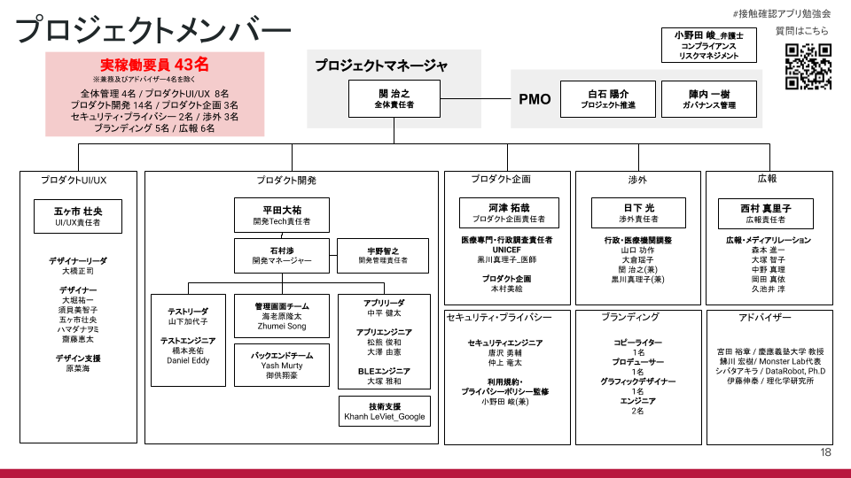

### 接触確認アプリ「まもりあいJapan」を支える技術

- 2020.06.01 16:30-18:00
- https://codeforjapan.connpass.com/event/177786/ 

---

### disclaimer

+++

- 本勉強会は接触確認アプリに有志で取り組んだプロボノチーム「まもりあいJapan」の主催によるものであり、厚生労働省ならびに内閣官房新型コロナウイルス感染症対策テックチームの活動と関係するものではありません。

+++

- 本勉強会の中で紹介するアプリやシステムとしての「まもりあいJapan」は、前記のプロボノチームが独自で開発を進めてきたアプリの名称であり、今後厚生労働省がリリースするアプリと関係するものではありません。

+++

- 本イベント内で解説される接触確認アプリの仕様は「まもりあいJapan」がこれまで開発してきたものに限定されており、勉強会の中で各登壇者が行う発言はすべてこの範囲での検討結果や実装内容に関するものです。

+++

- ですので、sli.do等でいただくご質問によっては注目度の高いものであってもお答えできない場合がございます:bow:

---

### まもりあいJapan is what

+++

### プロジェクトの経緯(1/2)

- 3月21日 黒川真理子先生より、コンタクトトレーシングアプリの必要性や可能性についてメールをいただき、検討を始める
- 関係各所へヒアリングを開始。平行でチームビルディング。プロジェクトが進むにつれ、一騎当千のメンバーが集合、自律性の高いチームが形成される💪

+++

### プロジェクトの経緯(2/2)

- 4月6日の、内閣官房 新型コロナウイルス感染対策テックチーム会合にて、プロジェクトについて発表
- 5月8日 厚生労働省がアプリを一元的に開発するという決定を受け、Code for Japan としてのアプリ公開は断念。仕様策定の協力などの形での協力に切り替え

+++

### 我々はなぜここにいるのか (行動原則)

- 新型コロナウイルスの感染拡大を防ぎ、一人でも多くの人の命を救う
- 医療関係者の負担を減らし、拡大防止のための有用な情報を提供する
- 利用者のプライバシーを守り、皆でコロナウイルスへ立ち向かうためのツールを提供する

+++

+++

### この勉強会の目的

- 接触確認アプリは、国民の理解と活用がとても大事
- これまでの知見は、きっと一般の接触確認アプリの理解に役にたつはず！
- プライバシーと公衆衛生のバランスなど、難しい概念をちゃんとお伝えしたい！

---

### sli.doによる質問(Q&A)を受け付けますので、ぜひご参加ください

- URL https://app.sli.do/event/lfhpnzzh
- event code #88763
  
---

### 登壇者紹介

+++

### 平田大祐

- 開発技術責任者
- Monstar Lab

+++

### Yash Murty

- バックエンドエンジニア
- Monstar Lab

+++

### 御供翔豪

- バックエンドエンジニア
- Monstar Lab

+++

### 中平健太

- アプリ開発リーダ

+++

### 松熊俊和

- アプリエンジニア(Android)

+++

### 大澤由憲

- アプリエンジニア(iOS)

+++

### 大塚雅和

- BLEエンジニア

+++

### 黒川真理子

- プロダクト企画
- 医師

+++

### モデレータ

- 関治之 (PM)
- 白石陽介 (PMO)
- 河津拓哉 (プロダクト企画責任者)

---

### App Demo

#### speakers
- 平田大祐
- 全員

---

### アーキテクチャ, 技術スタック

#### speakers
- BE: 御供翔豪, Yash Murty
- FE: 中平健太, 松熊俊和, 大澤由憲

+++

### reference

- https://github.com/mamori-i-japan/mamori-i-japan-api

---

### 匿名性への配慮 (認証,ID生成)

#### speakers
- BE: 御供翔豪, Yash Murty
- FE: 中平健太

+++

### topic

- 認証シーケンス
- 採用した技術
- 認証処理クライアントの話

+++

### reference

- https://github.com/mamori-i-japan/mamori-i-japan-api/tree/master/docs

---

### BLE制御

#### speakers
- BLE: 大塚雅和
- FE: 中平健太, 松熊俊和, 大澤由憲

+++

### topic

- BLE周りの実装経緯
- BLE実装技術解説

---

### プロジェクト進行の工夫や課題

#### speakers
- BE: 御供翔豪, Yash Murty
- FE: 中平健太, 松熊俊和, 大澤由憲

+++

### topic

- 要件/仕様まわり
- インターフェース整合性
- その他

---

### EoP

- ありがとうございました!

---

